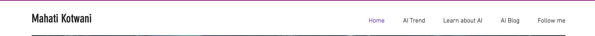
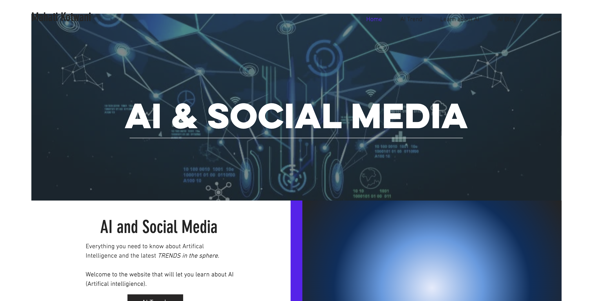
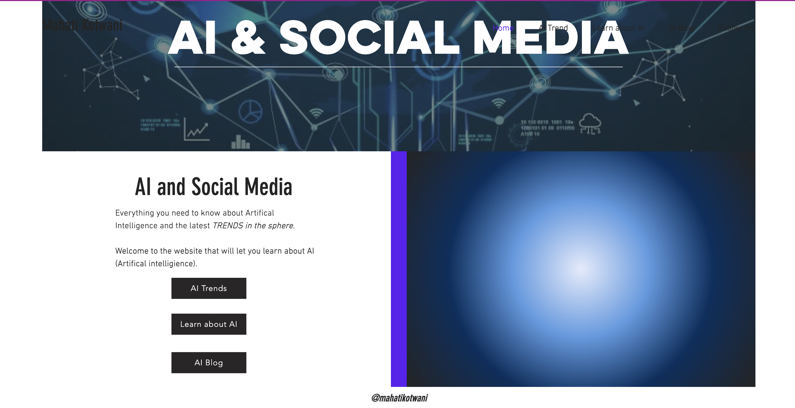

# CS220AU Digital Portfolio Template (2022)
## Overview
This GitHub repository is the template for the [CS220AU](https://github.com/khofstadter/CS220AU) assignment in 2022. It demonstrates minimalistic ideas for 

- project management
- web hosting with [GitHub Pages](https://pages.github.com/) 
- web-design with [Markdown language](https://guides.github.com/features/mastering-markdown/) and
- evaluation with the `assessment.md` and the `dp-checklist.md` files. 

The URL of the website can be found in the sidebar, under 'About'. The homepage uses the information in the `index.md` file.

 

## Portfolio items
The portfolio you submit needs to contain the following:

1. **website** (80% of your overall mark) exploring the theme given.
2. **self-and peer-assessment** (10% of your overall mark) using the marking rubric in the `assessment.md` file.
3. **portfolio overview** (10% of your overall mark) providing a succinct overview of your portfolio, an outline of completed tasks (Log) and tasks to do (TODO) in this `README.md` file.

After you finish these items, complete the `dp-checklist.md` file, download it and submit it on FASER. (Please keep this file in your repository as well after submitting.) In essence, you need to submit only one file on FASER, this `dp-checklist.md`. 

How to use this GitHub repository as a template for your submission, including how to submit your files on FASER is demonstrated in class. If anything is unclear, ask for clarification. 

 

## Log
### in week 3
- [x] Researching and Understanding about AI
- [x] Reading and Watching about AI
### in week 4
- [x] Start Brainstorming and Planning my Website

### in week 5
- [x] Create Layout of Website 
- [x] Star Looking for Content (That can go on my Website)

### in week 6
- [x] Finalize list of Content that would go on the Website 
### in week 7
- [x]  Figuring out Visuals and Design of the Page
- [x]  Creating MiniMockups

## TODO

### in week 9
- [ ]  Need to start Building Website and experimenting with Github

## Website Brainstorming
 The website will be a place where anyone who wants to learn about AI and be updated with the most intersting News about AI and Social Media. The site will have good visuals and a list of updated Videos in order to learrn and be updated on the latest Trend. The page will allso have mini blogs about certian topics about AI and my personal opnions and thoughts would be put in the blog.
 
## Website Layout

### Pages

1. HomePage (About Website )
2. About AI
3. AI Trends (Video and News Articles)
4. AI blogs

### Page 1- Design Of Homepage 
 Homepage 
 Photo’Ai related- and a small text box- With Intro https://images.app.goo.gl/itGnf2Xs7hSRGprD6 Small Section Explaining what the page is about 

Section 1- 

Photo on the left side

Text- Welcome to the Webpage about everything related to artificial intelligence and social media. You can find here videos and News articles related to social media and ai and my personal blog on AI and Social Media impacts.

Section 2

Select what youre looking for 

AI Trends (Button)
Learn about AI (button)
AI Blog (button)

###  Page 2
AI Learn
Information and Pictures about AI neatly presented

### Page 3
AI Trends 
 Multiple column with Videos and a small description
 Multiple column with nEWS and a small description

### Page 4
AI blog 
Multiple column with blogs when expanded personal blog will open

## Website Content
https://images.app.goo.gl/3uismQ29gpp7UAqD9
https://images.app.goo.gl/dK4mn3Cs9TbKoZhe9
https://images.app.goo.gl/EkQTeJYNZE2VFaJM7
https://images.app.goo.gl/M7d344Mp4U3ND32UA
https://images.app.goo.gl/FAFTG7d4FsY7jHVF9
https://images.app.goo.gl/XeRQ3mgL6fHGLjN5A

https://www.youtube.com/watch?v=ad79nYk2keg&ab_channel=Simplilearn

https://www.youtube.com/watch?v=uh5LCXOBmSI&ab_channel=Simplilearn

https://www.youtube.com/watch?v=JMLsHI8aV0g&ab_channel=WallStreetJournal

https://www.youtube.com/watch?v=6XfvBb2L01Q&ab_channel=SocialMediaExaminer

https://www.youtube.com/watch?v=I-EIVlHvHRM&ab_channel=WIRED

## Website Visuals (Mockup)

  

