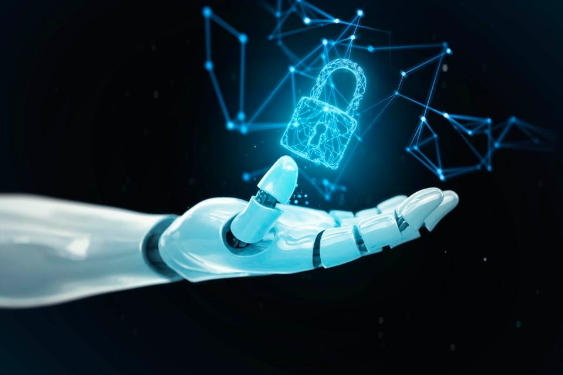

Artificial intelligence has led to some major changes in the nature of business. Companies around the world spent over $328.34 billion on AI last year and this figure is growing at a rapid rate. It is projected to be worth nearly $1.4 trillion by 2029.

Many companies have started using AI technology to streamline and automate many aspects of their operations, including social media marketing.

However, this has led to some new risks as well. A growing number of hackers are taking advantage of AI technology to commit brazen data breaches or even take over entire networks. They are also using AI-driven hacking strategies to take over social media profiles to trick other victims, steal data or maliciously tarnish their targets’ brand images.

# How AI Can Compromise Cybersecurity

### Even the most sophisticated hacking tools need human-like intelligence to direct them against potential victims. That's where AI comes in.

Using AI, cybercriminals can remain dormant and undetected within a company's network for extended periods, during which time they can set up back doors to an organization's critical infrastructure. Then, once ready to launch an attack against the wider business, they can eavesdrop on meetings, extract data, spread malicious software, create privileged accounts to access other systems and/or install ransomware.

AI is a particularly effective tool for cybercriminals because of its ability to learn and anticipate what's happening now and what might happen in the future.

### Some key methods cybercriminals use to hack into companies' networks with AI include:

1. Creating deepfake data.
2. Building better malware.
3. Stealth attacks.
4. AI-supported password-guessing and CAPTCHA-cracking.
5. Generative Adversarial Networks (GANs).
6. Human impersonation on social networking platforms.
7. Weaponizing AI frameworks for hacking vulnerable hosts.
8. Deep exploits.
9. ML-enabled penetration testing tools.

### According to Malwarebytes, there has been a recent surge in cyberattacks where hackers use AI and ML(Machine learning) to hide behind an organization's website or infrastructure. So, to remain secure and stay in business, companies must fight fire with fire and adopt AI & ML to keep their networks safe. 
