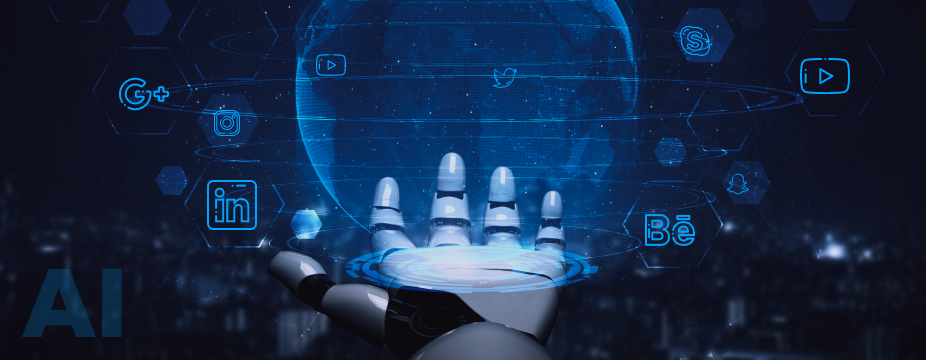

# AI and Social Media

## Welcome to the Webpage about everything related to AI (Artificial Intelligence) and social media including its benefits and risk and my opnions on it

## What is Artificial Intelligeince?
the theory and development of computer systems able to perform tasks that normally require human intelligence, such as visual perception, speech recognition, decision-making, and translation between languages.

## What are the current main stream uses of AI?
AI applications include advanced web search engines (e.g., Google), recommendation systems (used by YouTube, Amazon and Netflix), understanding human speech (such as Siri and Alexa), self-driving cars (e.g., Tesla), automated decision-making and competing at the highest level in strategic game systems (such as chess and Go).

##  [The AI Blog](aiblogs.md) -find out more about whats happening in the world of AI.

## [Risks of AI](airisks.md)- Altough AI is changing the world we are living in- its important to understantd the risks it can impose ##

